<div align="center">

<!-- Banner Matrix Rain animado -->


<!-- Typing effect -->
<a href="https://git.io/typing-svg">
  
</a>

</div>

---

<div align="center">

```
 ██████╗ █████╗ ██████╗ ██╗      ██████╗ ███████╗
██╔════╝██╔══██╗██╔══██╗██║     ██╔═══██╗██╔════╝
██║     ███████║██████╔╝██║     ██║   ██║███████╗
██║     ██╔══██║██╔══██╗██║     ██║   ██║╚════██║
╚██████╗██║  ██║██║  ██║███████╗╚██████╔╝███████║
 ╚═════╝╚═╝  ╚═╝╚═╝  ╚═╝╚══════╝ ╚═════╝ ╚══════╝
        ┌──────────────────────────────┐
        │  Security Researcher & Dev   │
        └──────────────────────────────┘
```

</div>

---

### `> whoami`

```python
#!/usr/bin/env python3

class Carlos:

    def __init__(self):
        self.name       = "Carlos"
        self.alias      = "c4o5.sec"
        self.role       = "Offensive Security Enthusiast"
        self.education  = "Segurança da Informação"
        self.background = "2 anos de ADS → migrou pra InfoSec"
        self.location   = "Brazil 🇧🇷"
        self.portfolio  = "https://github.com/carlos-offsec"
        self.motto      = "Quebrando pra entender como funciona."

    def get_skills(self):
        return {
            "languages"  : ["Python", "C", "Bash", "x86 Assembly"],
            "security"   : ["Pentesting", "OSINT", "Red Team", "Exploit Dev"],
            "systems"    : ["Linux", "Networking", "Reverse Engineering"],
            "offensive"  : ["Metasploit", "Cobalt Strike", "Burp Suite", "SQLMap"],
            "reversing"  : ["IDA Pro", "Ghidra", "Radare2", "x64dbg", "GDB"],
            "forensics"  : ["Volatility", "Autopsy", "Wireshark", "CyberChef"],
            "networking" : ["Nmap", "Masscan", "Responder", "BloodHound"],
            "cracking"   : ["Hashcat", "John the Ripper", "Hydra"]
        }

    def current_focus(self):
        return [
            "🔬 Análise de malware e engenharia reversa",
            "🛡️ Construindo honeypots e ferramentas de defesa",
            "⚔️ Desenvolvendo payloads e simulações ofensivas",
            "📡 Pesquisa em OSINT e coleta de inteligência",
            "📚 Cursando Segurança da Informação"
        ]

me = Carlos()
```

---

### `> ls -la ./arsenal`

#### ⌨️ Languages & OS
<p align="left">
  
  
  
  
  
  
  
</p>

#### ☠️ Offensive Security
<p align="left">
  
  
  
  
  
  
  
</p>

#### 🔬 Reverse Engineering & Forensics
<p align="left">
  
  
  
  
  
  
  
</p>

#### 🌐 Networking & Recon
<p align="left">
  
  
  
  
  
  
  
</p>

---

### `> cat /proc/self/status`

```
┌───────────────────────────────────────────────────────────────────┐
│                                                                   │
│  🎓 Formação                                                     │
│  ├── Segurança da Informação (cursando)                          │
│  └── Análise e Desenvolvimento de Sistemas (2 anos — base)       │
│                                                                   │
│  ⚡ Trajetória                                                    │
│  ├── Comecei em dev (ADS) → descobri a paixão por segurança      │
│  ├── Migrei pra InfoSec e nunca mais olhei pra trás              │
│  └── Foco 100% em ofensivo: pentest, red team, exploit dev       │
│                                                                   │
│  🔥 Áreas de Foco                                                │
│  ├── 🐍 Python — automação e ferramentas ofensivas               │
│  ├── ⚙️  C/ASM  — exploits, shellcode e baixo nível              │
│  ├── 🐧 Linux  — ambiente nativo, scripts e automação            │
│  ├── 🔒 Pentest — testes de intrusão e análise de vulns          │
│  ├── 🧭 OSINT  — coleta de intel e reconhecimento                │
│  └── ☠️  Red Team — simulações ofensivas e evasão                 │
│                                                                   │
└───────────────────────────────────────────────────────────────────┘
```

---

### `> cat /var/log/activity.log`

<div align="center">


</div>

<div align="center">


</div>

---

<div align="center">

### `> netstat -an | grep ESTABLISHED`

[](mailto:carlosincodeland@gmail.com)
[](https://www.linkedin.com/in/carlosincodeland)
[](https://github.com/carlos-offsec)

---

```
[*] Session established.
[*] All modules loaded.
[*] Status: ONLINE
[*] "Quebrando pra entender como funciona."
```


</div>
